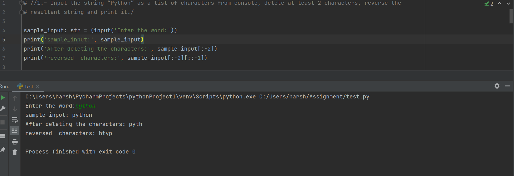
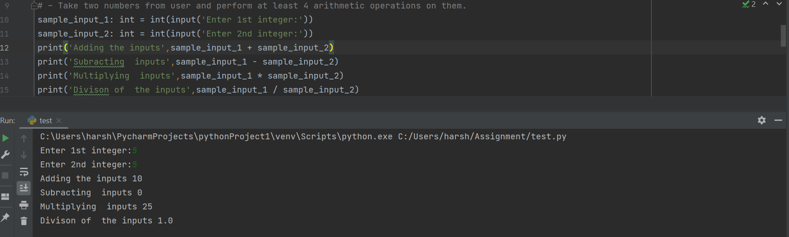
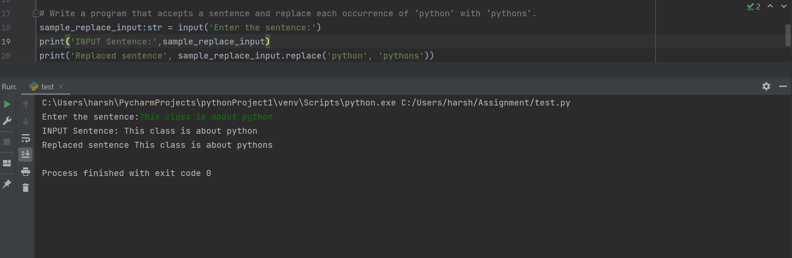
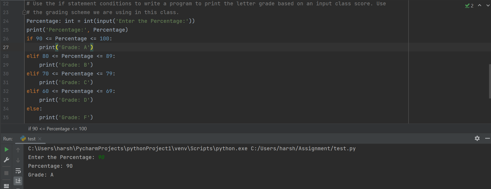

# Summary

**In the first question**

- i. I am using input() to read the input from console and concatenating the two strings
     
 
- ii. In the second part of the first question, I am fetching the values from console using input() function and iterating through the string using range and len() functions
  

**In the second question:**

- I am taking the sentence from the file and directing the sys output to file

**In the third question:**

- In fourth I am using the values from list and iterate using map function in nested loop
- I am using list comprehension and round function to give the appropriate results.

Video Link: <a href="https://ucmo.hosted.panopto.com/Panopto/Pages/Viewer.aspx?id=86faee59-0c71-403c-9f89-af8b0064cb59" target="_blank"> CLICK HERE </a>
